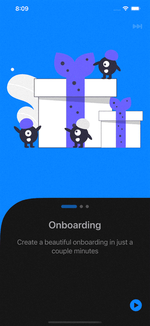

# Onboarder
> Create a beautiful Onabording for your iOS/iPadOS apps in just a few minutes.

## Preview



## Installation

1. In XCode 12 go to `File -> Swift Packages -> Add Package Dependency` or in XCode 13 `File -> Add Packages`
2. Paste in the repo's url: `https://github.com/JemAlvarez/onboarder` and select by version.

## Usage example

```swift
import Onboarder
import SwiftUI

struct OnboardingExample: View {
    let pages: [OBPage] = [ OBPage(color: .blue, imageName: "img", label: ("Page 1", "First page")), OBPage(color: .red, imageName: "img", label: ("Page 2", "Second page"))]

    let configuration: OBConfiguration = OBConfiguration(textContentBackgroundColor: Color("darkBlack"))

    var body: some View {
        // With custom configuration
        OnboardingView(pages: pages, config: configuration)

        // Without custom configuration
        OnboardingView(pages: pages)
    }
}
```

## Notes

* Support `iOS` & `iPadOS` version `14` and above
* For now it only support `SwiftUI`, with `UIKit` coming in the future

## Meta

Jem Alvarez – [@official_JemAl](https://twitter.com/official_JemAl) – contact@jemalvarez.com

Distributed under the MIT license. See ``LICENSE`` for more information.

[Onboarder](https://github.com/JemAlvarez/onboarder)
